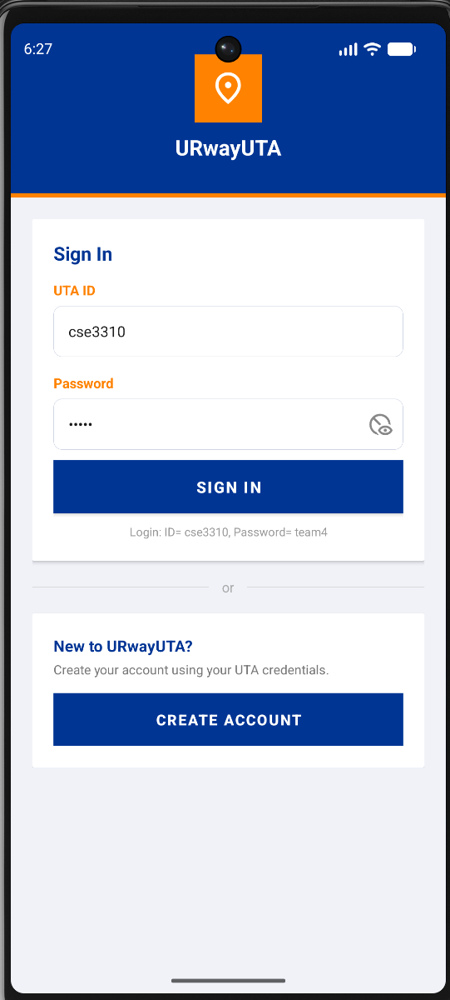
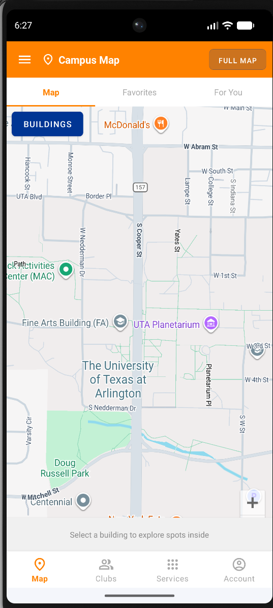
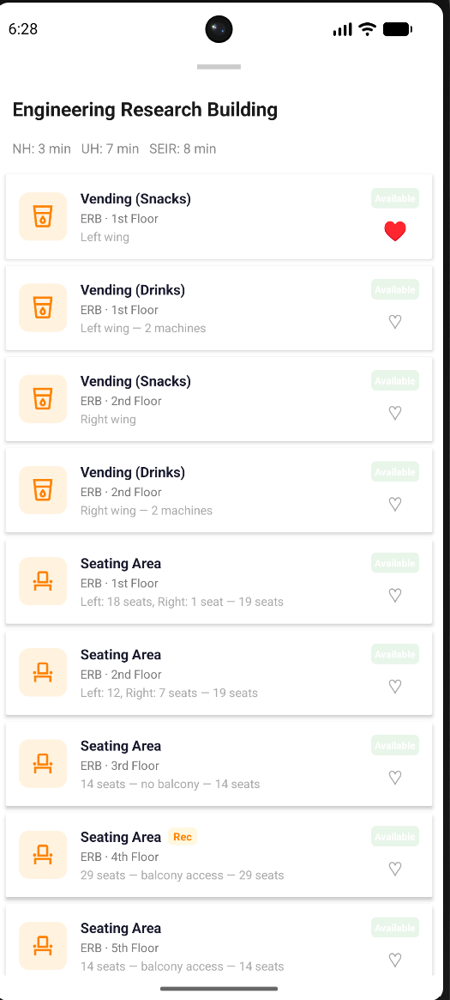
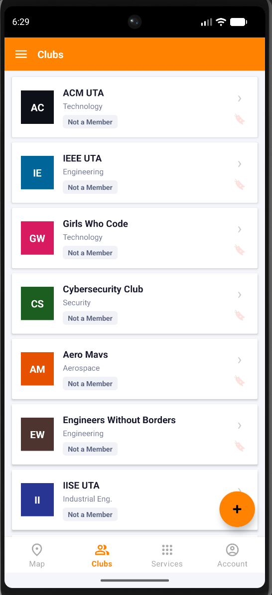
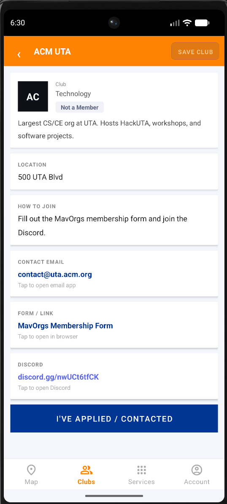

# urwayUTA
Android app to help UTA students navigate campus resources
## Screenshots | Sign In | Campus Map | Favorites | |---|---|---| |  |  |  | | For You | Clubs | Club Detail | |---|---|---| |  |  |  | ## Key Features - Secure sign-in with UTA credentials - Interactive campus map with building-level navigation - Save any spot as a favorite with one tap; view all saved spots anytime - Personalized 'For You' recommendations based on availability - Browse, join, and create student organizations - Drop custom private or public map pins for personal spots